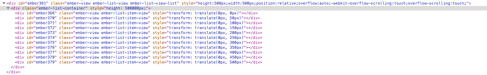
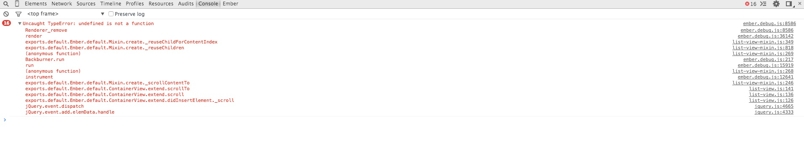

# Ember-list-view-bug

This is to illustrate some bugs in Ember ListView
- Using ListView with a `view` helper results in a list of empty views

- When using the `ember-list` helper items appear fine but disappear when you scroll

